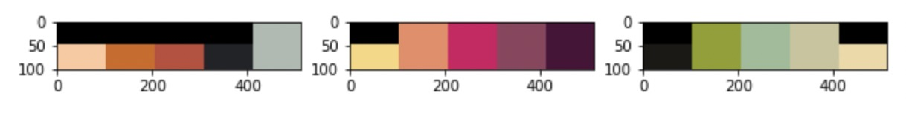
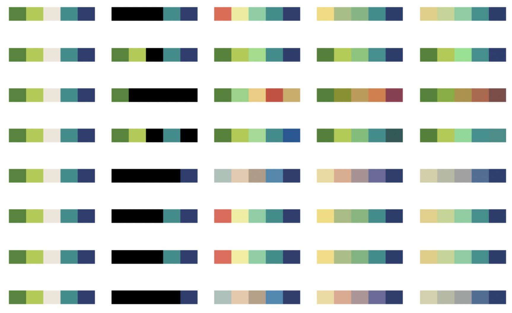

# palette-generator
Using deep learning method(GAN) to generate color palette


## 兼容

Python 3.6  
keras 2.2.0  
tensorflow 1.14.0


## 更新

| Date       | Update     |
| ---------- | ---------- |
| 2019-08-28 | 第一次上传 |

## 数据

如果想训练你自己的数据，那么请参考palettes文件夹下的格式


## 训练

请参考jupyter文件内的步骤操作

## 测试

```
python color_generator.py your_weight_path
```

## 预训练权重
链接：[baiduyun](链接:https://pan.baidu.com/s/1Qv7JkkKURRAdmOqIzsBbSg)  
密码:n2ps


## dataset
从[colorlover](https://www.colourlovers.com/)进行爬虫得到

训练数据：

  

测试效果：
